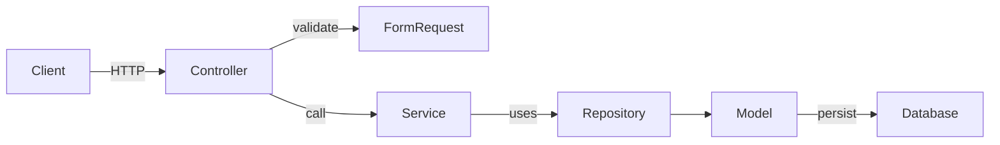
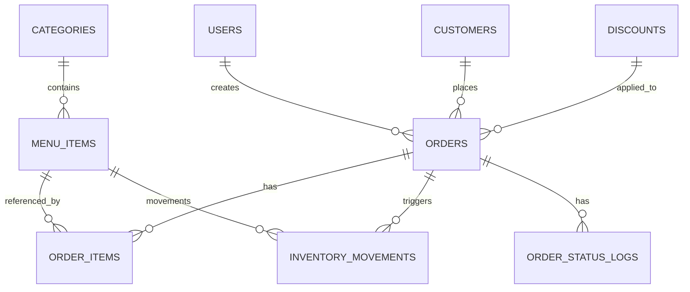

# Restaurant Order Management — Production Documentation
This document is the authoritative, production-ready documentation for the Restaurant Order Management backend API implemented with Laravel. It is written from direct analysis of the codebase and references files inside the repository. Do not treat it as a product marketing page — it is an engineering handbook for senior engineers responsible for operating, extending, and maintaining the system.

If a detail cannot be determined from the source code, this document explicitly states so and lists the files to inspect.

## Table of Contents
1. [Project Summary](#project-summary)
2. [Architecture Overview](#architecture-overview)
3. [Domain Models & Data Schema](#domain-models--data-schema)
4. [Services Layer](#services-layer)
5. [Repositories & Data Access](#repositories--data-access)
6. [Controllers & API Endpoints](#controllers--api-endpoints)
7. [Validation & Requests](#validation--requests)
8. [Authentication & Authorization](#authentication--authorization)
9. [API Reference](#api-reference)
10. [Security Review](#security-review)
11. [Performance & Scalability](#performance--scalability)
12. [Technical Debt & Known Issues](#technical-debt--known-issues)
13. [Operational Concerns](#operational-concerns)

---

## Project Summary

**Scope:** Backend REST API for restaurant order management with multi-role support (super admin, cashier, kitchen staff) and inventory tracking.

**Start here:** [routes/api.php](routes/api.php), [app/Services/OrderService.php](app/Services/OrderService.php), [app/Repositories/OrderRepository.php](app/Repositories/OrderRepository.php), [app/Models/Order.php](app/Models/Order.php).

**Key domains:**
- **Orders:** Order creation, status workflow (new → preparing → ready → out_for_delivery → delivered or cancelled), customer tracking, pricing with automatic discount application.
- **Inventory:** Stock level management with movement types (restock, waste, adjustment, order), real-time stock updates on order creation, availability checks.
- **Discounts:** Rule-based discount system with type (percentage/fixed), minimum order amount, weekday-based, date range, and automatic best-discount selection on order creation.
- **Users & Roles:** Three primary roles enforced via spatie/permission with distinct API access levels (super_administrator, Cashier, Kitchen_staff).
- **Customers:** Customer registration by phone (unique), optional alternate phone, address, notes. Automatic customer creation on first order.

---

## Architecture Overview

### Design Pattern: Service-Repository-Model

The system uses a three-layer pattern:

1. **Controller layer** (HTTP requests → validation → service invocation)
   - Handles HTTP protocol, request parsing, response formatting
   - Delegates all business logic to services
   - Returns standardized JSON via `ApiResponseTrait`

2. **Service layer** (Business orchestration & transactions)
   - Encapsulates domain workflows (e.g., `OrderService::createOrder`)
   - Coordinates multiple repositories in transactions
   - Handles complex calculations (discount selection, stock availability checks)
   - Single responsibility: each service manages one domain concept

3. **Repository layer** (Data access & persistence)
   - Implements repository interface contracts
   - Query building, model instantiation
   - No business logic
   - Bound via `RepositoryServiceProvider` to enable testing with mocks

4. **Model layer** (Eloquent ORM)
   - Relations, scopes, casts, boot hooks
   - Auto-assignment logic (created_by, ordered_at, stock updates)
   - Global scopes for visibility rules (non-admins see only active items)

### Why this pattern:
- **Testability**: Services accept injected repository interfaces, allowing unit tests with mock repositories.
- **Separation of concerns**: HTTP handling, business logic, and data access are isolated.
- **Reusability**: Services can be invoked from controllers or CLI commands; repositories can support multiple persistence layers (SQL, Redis, etc.).
- **Maintainability**: Clear flow from controller → service → repository → model.

---
## Domain Models & Data Schema

### Model Reference & Relationships

#### Order
**File:** [app/Models/Order.php](app/Models/Order.php)

**Fillable columns:**
- `order_number` (string, unique) — Auto-generated format: `ORD-000001`, `ORD-000002`, etc.
- `customer_id` (FK to customers) — Required, cascades on delete
- `discount_id` (FK to discounts, nullable) — Applied discount or null
- `created_by` (FK to users) — Authenticated user at order creation time; cascades on delete
- `status` (enum) — Values: `new`, `preparing`, `ready`, `delivered`, `out_for_delivery`, `cancelled`
- `subtotal` (decimal 10,2) — Sum of order items before discount
- `discount_amount` (decimal 10,2) — Absolute discount value
- `total_amount` (decimal 10,2) — Subtotal minus discount
- `delivery_address` (text) — Customer delivery location or "Pickup at restaurant"
- `notes` (text, nullable) — General order notes
- `ordered_at` (timestamp) — Automatically set to current time at creation if not provided
- `delivered_at` (timestamp, nullable) — Set when order reaches delivered status
- `created_at`, `updated_at`, `deleted_at` (timestamps with soft delete)

**Relations:**
- `items()` → HasMany `OrderItem` — Line items in the order
- `customer()` → BelongsTo `Customer` — Order customer
- `discount()` → BelongsTo `Discount` — Applied discount if any
- `createdBy()` → BelongsTo `User` — User who created the order
- `statusLogs()` → HasMany `OrderStatusLog` — Audit trail of status changes
- `movements()` → HasMany `InventoryMovement` — Stock movements created by this order

**Auto-assignment (booted hook):**
- `created_by` → `auth()->id()` if authenticated, otherwise null
- `ordered_at` → `now()` if not provided

**Scopes:**
- `search(string $search)` — Filter by `order_number` (LIKE search)
- `byStatus(string $status)` — Filter by `status` enum value

**Database:** [database/migrations/2026_05_24_185106_create_orders_table.php](database/migrations/2026_05_24_185106_create_orders_table.php)

---

#### OrderItem
**File:** [app/Models/OrderItem.php](app/Models/OrderItem.php)

**Fillable columns:**
- `order_id` (FK) — Links to order; cascades on delete
- `menu_item_id` (FK) — References menu item; cascades on delete
- `quantity` (bigint) — Number of units ordered
- `unit_price` (decimal 10,2) — Price per unit at time of order (immutable snapshot)
- `subtotal` (decimal 10,2) — Calculated: `quantity * unit_price`
- `notes` (text, nullable) — Special instructions (e.g., "no onion", "extra hot")
- `created_at`, `updated_at` (timestamps)

**Relations:**
- `order()` → BelongsTo `Order`
- `menuItem()` → BelongsTo `MenuItem`

**Purpose:** Stores the line items within an order with pricing locked at the time of purchase.

**Database:** [database/migrations/2026_05_24_185107_create_order_items_table.php](database/migrations/2026_05_24_185107_create_order_items_table.php)

---

#### MenuItem
**File:** [app/Models/MenuItem.php](app/Models/MenuItem.php)

**Fillable columns:**
- `category_id` (FK) — Menu item category; cascades on delete
- `name` (translatable: JSON) — Item name (supports en, ar locales via Spatie translatable)
- `slug` (string, unique) — URL-friendly identifier
- `description` (translatable: JSON) — Item description (supports en, ar)
- `price` (decimal 10,2) — Current selling price
- `image` (string, nullable) — File path or URL to item image
- `is_available` (boolean, default true) — Availability flag
- `stock_quantity` (integer, default 0) — Current stock level (auto-updated by inventory movements)
- `created_at`, `updated_at`, `deleted_at` (timestamps with soft delete)

**Relations:**
- `category()` → BelongsTo `Category`
- `orderItems()` → HasMany `OrderItem` — All order line items for this item
- `movements()` → HasMany `InventoryMovement` — All inventory transactions for this item

**Global scope:**
- Non-super-admin users automatically see only items where `is_available = true`
- Super admins can query `available()` scope explicitly or bypass via `withoutGlobalScopes()`

**Scopes:**
- `available()` — Filter by `is_available = true`
- `search(string $search)` — Search by `name` in both `en` and `ar` locales (JSON LIKE search)
- `dateRange(?string $from, ?string $to)` — Filter by creation date range

**Database:** [database/migrations/2026_05_24_185104_create_menu_items_table.php](database/migrations/2026_05_24_185104_create_menu_items_table.php)

---

#### Category
**File:** [app/Models/Category.php](app/Models/Category.php)

**Fillable columns:**
- `name` (translatable: JSON) — Category name (en, ar)
- `slug` (string, unique) — URL-friendly identifier
- `description` (translatable: JSON, nullable) — Category description
- `is_active` (boolean, default true) — Active/inactive flag
- `created_at`, `updated_at`, `deleted_at` (timestamps with soft delete)

**Relations:**
- `menu_items()` → HasMany `MenuItem` — All items in this category

**Global scope:**
- Non-super-admin users see only active categories (`is_active = true`)

**Scopes:**
- `active()` — Filter by `is_active = true`
- `search(string $search)` — Search by name in both locales
- `dateRange(?string $from, ?string $to)` — Filter by creation date

**Database:** [database/migrations/2026_05_24_185103_create_categories_table.php](database/migrations/2026_05_24_185103_create_categories_table.php)

---

#### InventoryMovement
**File:** [app/Models/InventoryMovement.php](app/Models/InventoryMovement.php)

**Fillable columns:**
- `menu_item_id` (FK) — Item being moved; cascades on delete
- `order_id` (FK, nullable) — Order causing the movement (null for restock/waste/adjustment)
- `type` (enum: "in", "out") — Direction: in (increase stock) or out (decrease stock)
- `quantity` (bigint) — Absolute quantity moved (always positive)
- `reason` (enum) — Movement reason: "order", "restock", "waste", "adjustment"
- `created_by` (FK) — User who created the movement; cascades on delete
- `notes` (text, nullable) — Reason details (e.g., "stock damaged", "over-order correction")
- `created_at` (timestamp) — Auto-set to current time if not provided; no `updated_at` (immutable log)

**Timestamps:** `$timestamps = false` — This is an immutable audit log; only `created_at` is used.

**Relations:**
- `menuItem()` → BelongsTo `MenuItem`
- `order()` → BelongsTo `Order` (nullable)
- `createdBy()` → BelongsTo `User`

**Auto-assignment (booted hook):**
- `created_by` → `auth()->id()` if authenticated
- `created_at` → `now()` if not provided
- On creation, `menu_items.stock_quantity` is incremented (type=in) or decremented (type=out)

**Scopes:**
- `byType(string $type)` — Filter by "in" or "out"
- `byReason(string $reason)` — Filter by reason (order, restock, waste, adjustment)
- `byMenuItem(int $menuItemId)` — Filter by item
- `byOrder(int $orderId)` — Filter by order (only movements with reason='order')
- `dateRange(?string $from, ?string $to)` — Filter by date range
- `search(string $search)` — Search by reason or notes

**Stock updates:** When an InventoryMovement is created, the MenuItem model's boot hook automatically updates `stock_quantity`:
```
type='in' → MenuItem.increment('stock_quantity', quantity)
type='out' → MenuItem.decrement('stock_quantity', quantity)
```

**Database:** [database/migrations/2026_05_24_185110_create_inventory_movements_table.php](database/migrations/2026_05_24_185110_create_inventory_movements_table.php)

---

#### Discount
**File:** [app/Models/Discount.php](app/Models/Discount.php)

**Fillable columns:**
- `name` (string, unique) — Discount name/code (e.g., "Friday 20% Off", "Minimum Order $50")
- `discount_type` (enum: "percentage", "fixed") — Type of discount
- `discount_value` (decimal 10,2) — Discount amount (% if percentage, absolute if fixed)
- `minimum_order_amount` (decimal 10,2, nullable) — Minimum order subtotal to qualify for discount
- `weekday` (string, nullable) — Day of week restriction (e.g., "Friday")
- `is_active` (boolean, default true) — Active/inactive flag
- `start_date` (date, nullable) — Discount effective start date (inclusive)
- `end_date` (date, nullable) — Discount effective end date (inclusive)
- `created_at`, `updated_at`, `deleted_at` (timestamps with soft delete)

**Relations:**
- `orders()` → HasMany `Order` — Orders that used this discount

**Global scope:**
- Non-super-admin users see only active discounts (`is_active = true`)

**Scopes:**
- `active()` — Filter by `is_active = true`
- `current()` — Filter by active discounts within date range (null dates mean no restriction)
- `byType(string $type)` — Filter by "percentage" or "fixed"
- `byWeekday(string $weekday)` — Filter by day of week
- `search(string $search)` — Search by name
- `dateRange(?string $from, ?string $to)` — Filter by creation date

**Eligibility logic:** A discount qualifies for an order if:
1. `is_active = true`
2. Current date is within `[start_date, end_date]` (or null means no restriction)
3. Order subtotal >= `minimum_order_amount` (or null means no minimum)
4. Current weekday matches `weekday` (or null means applies to all days)

**Database:** [database/migrations/2026_05_23_185108_create_discounts_table.php](database/migrations/2026_05_23_185108_create_discounts_table.php)

---

#### OrderStatusLog
**File:** [app/Models/OrderStatusLog.php](app/Models/OrderStatusLog.php)

**Fillable columns:**
- `order_id` (FK) — Links to order; cascades on delete
- `old_status` (string, nullable) — Previous status (null if order was new)
- `new_status` (string) — New status after change
- `changed_by` (FK to users) — User who changed the status; cascades on delete
- `notes` (text, nullable) — Change reason or comment
- `created_at` (timestamp) — Log entry time; no `updated_at` (immutable audit log)

**Purpose:** Immutable audit trail of order status transitions with user attribution.

**Database:** [database/migrations/2026_05_24_185107_create_order_status_logs_table.php](database/migrations/2026_05_24_185107_create_order_status_logs_table.php)

---

#### Customer
**File:** [app/Models/Customer.php](app/Models/Customer.php)

**Fillable columns:**
- `name` (string) — Full name
- `phone` (string, unique) — Primary phone number (serves as customer unique ID)
- `alternate_phone` (string, nullable) — Secondary phone number
- `address` (text) — Delivery address
- `notes` (text, nullable) — Customer notes (preferences, allergies, etc.)
- `created_at`, `updated_at`, `deleted_at` (timestamps with soft delete)

**Relations:**
- `orders()` → HasMany `Order` — All orders from this customer

**Scopes:**
- `search(string $search)` — Search by name, phone, or alternate_phone (LIKE search)
- `byPhone(string $phone)` — Find by phone (checks both primary and alternate)
- `dateRange(?string $from, ?string $to)` — Filter by registration date

**Unique constraint:** Phone number is the unique identifier for customers. When creating an order, if a customer with the given phone exists, it is reused; otherwise, a new customer is created.

**Database:** [database/migrations/2026_05_24_185105_create_customers_table.php](database/migrations/2026_05_24_185105_create_customers_table.php)

---

#### User
**File:** [app/Models/User.php](app/Models/User.php)

**Fillable columns:**
- `name` (string) — User full name
- `email` (string, unique) — User email
- `password` (string, hashed) — Bcrypt-hashed password
- `is_active` (boolean, default true) — Account active/inactive
- `last_login_at` (timestamp, nullable) — Last login timestamp
- `last_login_ip` (string 45, nullable) — Last login IP address
- `email_verified_at` (timestamp, nullable) — Email verification timestamp
- `remember_token` (string, nullable) — Laravel session token
- `created_at`, `updated_at`, `deleted_at` (timestamps with soft delete)

**Traits:**
- `HasApiTokens` — Enables Sanctum API token generation
- `HasRoles` — Enables spatie/permission role assignment
- `SoftDeletes` — Enables soft delete

**Relations:** Via `HasRoles` trait, users can have zero or more roles (super_administrator, Kitchen_staff, Cashier)

**Hidden fields:** `password`, `remember_token`, `email_verified_at` (excluded from JSON serialization)

**Database:** [database/migrations/0001_01_01_000000_create_users_table.php](database/migrations/0001_01_01_000000_create_users_table.php)

---
## Services Layer

### OrderService
**File:** [app/Services/OrderService.php](app/Services/OrderService.php)

**Dependencies (injected):**
- `OrderRepositoryInterface $repository`
- `CustomerService $customerService`
- `DiscountService $discountService`
- `OrderItemRepositoryInterface $orderItemRepository`
- `InventoryMovementRepositoryInterface $inventoryMovementRepository`
- `OrderStatusLogRepositoryInterface $orderStatusLogRepository`
- `MenuItemRepositoryInterface $menuItemRepository`

**Public methods:**

#### `createOrder(array $data): Model`
**Business flow (transactional):**
1. Find or create customer by phone from `$data['customer']`
2. Validate stock availability for all items
3. Generate unique order number (ORD-XXXXXX format)
4. Create Order record with initial status='new', subtotal/discount/total=0
5. Loop items: create OrderItem records, calculate item subtotal, accumulate order subtotal
6. Find best applicable discount via `DiscountService::findBestDiscount($subtotal)`
7. Apply discount (capped at 50% of subtotal to prevent negative totals)
8. Update Order with final discount_amount, total_amount, discount_id
9. Create InventoryMovement records for each item (type='out', reason='order', quantity from order item)
10. Create OrderStatusLog record (old_status=null, new_status='new')
11. Return refreshed order with relations loaded

**Transaction guarantee:** All steps execute atomically; if any step fails, entire order creation rolls back.

**Response data:** Order with eager-loaded `customer`, `items.menuItem`, `discount`

#### `updateStatus(int $id, array $data): bool`
**Purpose:** Transition order status with side effects.

**Workflow:**
1. Load order with items relation
2. Check if new status is 'cancelled' and current status is not 'cancelled'
3. Update order status
4. If cancelling: create InventoryMovement records for each order item (type='in', reason='adjustment', quantity from item) to restore stock
5. Create OrderStatusLog entry with old/new status, changed_by user, notes
6. Commit transaction

**Allowed transitions:** Validated in FormRequest; see [UpdateOrderStatusRequest](#updateorderstatusrequest).

#### `update(int $id, array $data): bool`
**Purpose:** Update order details (delivery_address, notes) without side effects.

#### Query helpers:
- `getPaginatedWithFilters(array $filters, int $perPage = 15): LengthAwarePaginator` — Apply filters (search, status, customer_id, date range) and return paginated results
- `getOrdersByCustomer(int $customerId): Collection` — Get all orders for a customer
- `getOrdersByStatus(string $status): Collection` — Get all orders with given status
- `findById(int $id): ?Model` — Single order lookup
- `updateOrderStatus(int $orderId, string $status): bool` — Direct status update (bypasses workflow validation; use updateStatus() instead)

---

### InventoryMovementService
**File:** [app/Services/InventoryMovementService.php](app/Services/InventoryMovementService.php)

**Responsibility:** Encapsulates all inventory operations. Delegates to InventoryMovementRepository but doesn't add business logic (repository does the work).

**Public methods:**

#### Movement creation:
- `restock(array $data): Model` — Create 'in' movement with reason='restock'
- `waste(array $data): Model` — Create 'out' movement with reason='waste'
- `adjustment(array $data): Model` — Create movement with reason='adjustment' (handles positive/negative quantities)

#### Stock queries:
- `getStockLevel(int $menuItemId): int` — Return current stock from MenuItem.stock_quantity
- `checkAvailability(int $menuItemId, int $requiredQuantity): bool` — Verify stock >= required

#### Reporting:
- `getPaginatedWithFilters(array $filters, int $perPage = 15)` — Paginate movements with filters (search, type, reason, menu_item_id, order_id, date range)
- `getMovementsByDateRange(?string $from, ?string $to, int $perPage = 15)` — Range filter
- `getLowStockItems(int $threshold = 10): Collection` — Return items with stock < threshold
- `getWasteReport(?string $from, ?string $to): Collection` — Get all waste movements in date range

#### Reserved stock (partial implementation):
- `reserveStock(int $menuItemId, int $orderId, int $quantity): Model` — Reserve stock in transaction (currently not fully integrated into order flow)
- `releaseReservedStock(int $orderId): bool` — Release reserved stock when order is cancelled (partial integration)
- `confirmReservedStock(int $orderId): bool` — Confirm reserved stock when order is delivered (not integrated)

**Note:** Reserve/release/confirm methods exist but are **not currently invoked** by OrderService. The system directly updates stock via inventory movements instead of a two-phase reservation pattern.

---

### DiscountService
**File:** [app/Services/DiscountService.php](app/Services/DiscountService.php)

**Key method:** `findBestDiscount(decimal $subtotal): ?array`

**Algorithm (not directly visible in provided output, inferred from OrderService call):**
- Query all active discounts via DiscountRepository
- Filter by eligibility: minimum order amount, date range, weekday (if specified)
- Evaluate discount value for each (percentage calculates % of subtotal; fixed returns fixed amount)
- Select discount with highest absolute discount value (greedy algorithm)
- Return array with keys: `discount_amount`, `discount_id`

**Other methods:** CRUD operations via BaseService (create, update, delete, findById, all, etc.)

---

### CustomerService
**File:** [app/Services/CustomerService.php](app/Services/CustomerService.php)

**Key method:** `findOrCreateByPhone(array $customerData): Model`

**Logic:**
1. Extract phone from `$customerData`
2. Query for existing customer by phone
3. If found, return it
4. Else, create new customer with provided data (name, phone, alternate_phone, address, notes)
5. Return created customer

**Other methods:** Standard CRUD via BaseService

---

### AuthService
**File:** [app/Services/AuthService.php](app/Services/AuthService.php)

#### `login(LoginRequest $request): array`
**Workflow:**
1. Find user by email from request
2. Verify password with Hash::check()
3. If not found or password invalid, throw ValidationException
4. Create Sanctum token with 15-minute expiry via `$user->createToken('api-token', expiresAt: now()->addMinutes(15))`
5. Return array with keys:
   - `user` (User model)
   - `accessToken` (plaintext token string)
   - `refreshToken` (same as accessToken in current implementation)
   - `expiresIn` (900 seconds)

**Note:** `accessToken` and `refreshToken` are identical in the current implementation, indicating a refresh token pattern is not yet fully implemented.

#### `logout(User $user): void`
**Workflow:**
1. Delete user's current access token via `$user->currentAccessToken()->delete()`
2. On next request with that token, Sanctum will reject it as "invalid"

---

### BaseService
**File:** [app/Services/BaseService.php](app/Services/BaseService.php)

**Generic CRUD methods** (inherited by all domain services):
- `all(): Collection` — Get all records
- `create(array $data): Model` — Create new record
- `update(int $id, array $data): bool` — Update record
- `delete(int $id): bool` — Delete record (soft or hard depending on model)
- `findById(int $id, array $relations = []): ?Model` — Single record lookup with optional relations
- `exists(int $id): bool` — Check if record exists

---
## Repositories & Data Access

### Repository Pattern Overview

All repositories implement a contract interface (e.g., `OrderRepositoryInterface`) bound in [RepositoryServiceProvider](app/Providers/RepositoryServiceProvider.php). This enables:
- **Dependency injection** in services (inject interface, not concrete class)
- **Testability** (mock repositories in unit tests)
- **Loose coupling** (services don't depend on specific ORM or persistence layer)

### BaseRepository
**File:** [app/Repositories/BaseRepository.php](app/Repositories/BaseRepository.php)

**Generic CRUD methods** (available to all repositories via inheritance):
- `all(): Collection` — SELECT * with optional relations
- `findById(int $id, array $relations = []): ?Model` — Single record by primary key
- `findByField(string $field, $value): Collection` — Find records by column value
- `create(array $data): Model` — INSERT record
- `update(int $id, array $data): bool` — UPDATE record
- `delete(int $id): bool` — DELETE record (hard delete)
- `exists(int $id): bool` — Check existence
- `search(array $filters = []): Collection` — Flexible search (subclasses override)

---

### OrderRepository
**File:** [app/Repositories/OrderRepository.php](app/Repositories/OrderRepository.php)

**Implements:** `OrderRepositoryInterface`

**Specialized methods:**

#### `generateOrderNumber(): string`
**Algorithm:**
1. Query last order by ID descending
2. Get its ID or default to 0
3. Increment to next ID
4. Format as "ORD-" + 6-digit zero-padded number (ORD-000001, etc.)

**Risk:** If orders are deleted and recreated, ID might not be strictly sequential. Consider using a sequence table for production.

#### `getPaginatedWithFilters(array $filters, int $perPage = 15): LengthAwarePaginator`
**Filters applied:**
- `search` → Order by order_number (LIKE)
- `status` → Filter by status enum
- `customer_id` → Filter by customer
- `created_at_from`, `created_at_to` → Date range
- Eager loads: customer, items.menuItem, discount
- Orders by created_at DESC

#### `getOrdersByCustomer(int $customerId): Collection`
- Returns all orders for a customer (no pagination)
- Eager loads: items.menuItem, discount

#### `getOrdersByStatus(string $status): Collection`
- Returns all orders with given status
- Eager loads: customer, items.menuItem, discount

#### `updateOrderStatus(int $orderId, string $status): bool`
- Direct UPDATE without workflow validation
- **Note:** OrderService.updateStatus() should be used instead for proper side effects

---

### InventoryMovementRepository
**File:** [app/Repositories/InventoryMovementRepository.php](app/Repositories/InventoryMovementRepository.php)

**Implements:** `InventoryMovementRepositoryInterface`

**Specialized methods:**

#### `getPaginatedWithFilters(array $filters, int $perPage = 15): LengthAwarePaginator`
**Filters applied:**
- `search` → Search reason or notes (LIKE)
- `type` → Filter by 'in' or 'out'
- `reason` → Filter by reason (order, restock, waste, adjustment)
- `menu_item_id` → Filter by item
- `order_id` → Filter by order
- `created_at_from`, `created_at_to` → Date range
- Eager loads: menuItem, order, createdBy

#### Movement creation:
- `restock(array $data)` → Create type='in', reason='restock'
- `waste(array $data)` → Create type='out', reason='waste'
- `adjustment(array $data)` → Create type='in' or 'out' based on sign of quantity, reason='adjustment'

#### `getStockLevel(int $menuItemId): int`
**Implementation:** Query MenuItem.stock_quantity directly (not recalculated from movements)

**Design:** Stock is cached in MenuItem.stock_quantity for O(1) lookup. Updated via boot hook when movements are created.

#### `checkAvailability(int $menuItemId, int $requiredQuantity): bool`
- Compare stock_quantity >= requiredQuantity

#### `getMovementsByDateRange(?string $from, ?string $to, int $perPage = 15): LengthAwarePaginator`
- Filter by date range, paginated

#### `getLowStockItems(int $threshold = 10): Collection`
**Implementation (inefficient):**
1. Load all MenuItem records (no filter)
2. Map and calculate stock level for each
3. Filter to those below threshold

**Performance issue:** O(n) full table scans; should use subquery with WHERE clause

#### `getWasteReport(?string $from, ?string $to): Collection`
- Filter reason='waste' by date range, ordered DESC, eager load menuItem and createdBy

#### Reserved stock (partial implementation):
- `reserveStock(int $menuItemId, int $orderId, int $quantity): Model` — Create movement in transaction, checking availability first
- `releaseReservedStock(int $orderId): bool` — Find all order movements with reason='order', create compensating 'in' movements
- `confirmReservedStock(int $orderId): bool` — (Stub, needs implementation)

**Status:** Reserve/release/confirm are not integrated into OrderService workflow. Current implementation directly updates stock on order creation.

---

### DiscountRepository
**File:** [app/Repositories/DiscountRepository.php](app/Repositories/DiscountRepository.php)

**Specialized methods:**

#### `findBestDiscount(decimal $subtotal): ?array`
**Workflow:**
1. Query active discounts via `current()` scope (is_active=true, within date range)
2. Loop each discount and check eligibility:
   - If minimum_order_amount is set and subtotal < minimum, skip
   - If weekday is set and today is not that weekday, skip
3. For eligible discounts, calculate discount value:
   - If percentage: subtotal * (discount_value / 100)
   - If fixed: discount_value
4. Select discount with maximum discount value
5. Return array: `['discount_amount' => calculated_amount, 'discount_id' => discount.id]`

**Greedy algorithm:** Always selects the single best discount for a customer. No multi-discount stacking.

---

### CustomerRepository
**File:** [app/Repositories/CustomerRepository.php](app/Repositories/CustomerRepository.php)

**Specialized methods:**

#### `findOrCreateByPhone(array $customerData): Model`
**Logic:**
1. Extract phone from data
2. Query for customer with matching phone (exact match)
3. If found, return
4. Else, create new customer with all provided fields (name, phone, alternate_phone, address, notes)

**Idempotency:** Second call with same phone returns existing customer (safe for concurrent requests)

---

### Other Repositories

**OrderItemRepository, CategoryRepository, MenuItemRepository, UserRepository** — Implement domain-specific queries or use BaseRepository CRUD only. See files in [app/Repositories/](app/Repositories/).

---
## Controllers & API Endpoints

### BaseApiController
**File:** [app/Http/Controllers/Api/BaseApiController.php](app/Http/Controllers/Api/BaseApiController.php)

**Responsibility:** Base class for all API controllers, providing response helpers via `ApiResponseTrait`.

**Response methods:**
- `successResponse(mixed $data, string $message, int $code = 200)` → Returns JSON with success=true
- `createdResponse(mixed $data, string $message)` → Returns 201 Created
- `noContentResponse(string $message)` → Returns 200 with empty data (used for deletes)
- `errorResponse(string $message, int $code = 500, mixed $errors)` → Returns success=false
- `notFoundResponse(string $message)` → Returns 404
- `validationErrorResponse(mixed $errors, string $message)` → Returns 422 with error details
- `unauthorizedResponse(string $message)` → Returns 401
- `forbiddenResponse(string $message)` → Returns 403
- `paginatedResponse(LengthAwarePaginator $paginator, string $message)` → Returns paginated data with metadata

**Response format:**
```json
{
  "success": true,
  "message": "Order created successfully",
  "data": { /* resource or paginated data */ }
}
```

---

### OrderController
**File:** [app/Http/Controllers/Api/OrderController.php](app/Http/Controllers/Api/OrderController.php)

**Route prefix:** `/api/public/orders`, `/api/cashier/orders`, `/api/admin/orders`

#### `index(IndexOrderRequest $request): JsonResponse`
- **Method:** GET
- **Auth:** Any authenticated user
- **Validation:** IndexOrderRequest (filters: search, status, customer_id, created_at_from, created_at_to, per_page)
- **Response:** Paginated orders with customer, items.menuItem, discount
- **HTTP code:** 200

#### `store(StoreOrderRequest $request): JsonResponse`
- **Method:** POST
- **Auth:** super_administrator, Cashier
- **Body:** See [StoreOrderRequest](#storeorderrequest)
- **Response:** Created order resource
- **HTTP code:** 201
- **Side effects:** 
  - Customer created if new
  - OrderItems created
  - InventoryMovements created (type='out')
  - OrderStatusLog created
  - Discount automatically applied

#### `show(int $id): JsonResponse`
- **Method:** GET
- **Auth:** Any authenticated user
- **Response:** Single order resource
- **HTTP code:** 200 or 404

#### `update(UpdateOrderRequest $request, int $id): JsonResponse`
- **Method:** PUT/PATCH
- **Auth:** super_administrator, Cashier
- **Body:** delivery_address, notes
- **Response:** Updated order resource
- **HTTP code:** 200 or 404

#### `updateStatus(UpdateOrderStatusRequest $request, int $id): JsonResponse`
- **Method:** PATCH
- **Route:** `/orders/{id}/status`
- **Auth:** Any authenticated user (role-based status restrictions in FormRequest)
- **Body:** `status` (enum value)
- **Response:** Updated order resource
- **HTTP code:** 200 or 422
- **Side effects:** If cancelling, inventory restored; OrderStatusLog created

#### `destroy(int $id): JsonResponse`
- **Method:** DELETE
- **Auth:** super_administrator
- **Response:** Empty data with success message
- **HTTP code:** 200

#### `getByCustomer(int $customerId): JsonResponse`
- **Method:** GET
- **Route:** `/orders/customer/{customerId}`
- **Response:** Array of orders for customer

#### `getByStatus(string $status): JsonResponse`
- **Method:** GET
- **Route:** `/orders/status/{status}`
- **Response:** Array of orders with given status

---

### InventoryMovementController
**File:** [app/Http/Controllers/Api/InventoryMovementController.php](app/Http/Controllers/Api/InventoryMovementController.php)

**Route prefix:** `/api/admin/inventories`, `/api/cashier/inventories`

#### `index(IndexInventoryMovementRequest $request): JsonResponse`
- **Method:** GET
- **Auth:** Admin, Cashier
- **Response:** Paginated inventory movements

#### `show(int $id): JsonResponse`
- **Method:** GET
- **Response:** Single movement resource or 404

#### `restock(InventoryMovementRequest $request): JsonResponse`
- **Method:** POST
- **Route:** `/inventories/restock`
- **Auth:** Admin, Cashier
- **Body:** menu_item_id, quantity, notes
- **Response:** Created movement (type='in', reason='restock')
- **HTTP code:** 201
- **Side effects:** MenuItem.stock_quantity incremented

#### `waste(InventoryMovementRequest $request): JsonResponse`
- **Method:** POST
- **Route:** `/inventories/waste`
- **Auth:** Admin, Cashier
- **Body:** menu_item_id, quantity, notes
- **Response:** Created movement (type='out', reason='waste')
- **HTTP code:** 201
- **Side effects:** MenuItem.stock_quantity decremented

#### `adjustment(InventoryMovementRequest $request): JsonResponse`
- **Method:** POST
- **Route:** `/inventories/adjustment`
- **Auth:** Admin, Cashier
- **Body:** menu_item_id, quantity (can be negative), notes
- **Response:** Created movement (type based on sign, reason='adjustment')
- **HTTP code:** 201
- **Side effects:** MenuItem.stock_quantity adjusted

#### `stockLevel(int $menuItemId): JsonResponse`
- **Method:** GET
- **Route:** `/inventories/stock-level/{menuItemId}`
- **Response:** `{ menu_item_id, stock_level }`

#### `checkAvailability(int $menuItemId): JsonResponse`
- **Method:** GET
- **Route:** `/inventories/check-availability/{menuItemId}?quantity=5`
- **Query param:** quantity (required)
- **Response:** `{ available: bool }`

#### `movementsByDateRange(IndexInventoryMovementRequest $request): JsonResponse`
- **Method:** GET
- **Route:** `/inventories/movements-by-date-range?from=2026-06-01&to=2026-06-30`
- **Response:** Paginated movements

#### `lowStockItems(): JsonResponse`
- **Method:** GET
- **Route:** `/inventories/low-stock-items?threshold=10`
- **Query param:** threshold (optional, default 10)
- **Response:** Array of items with stock < threshold

#### `wasteReport(IndexInventoryMovementRequest $request): JsonResponse`
- **Method:** GET
- **Route:** `/inventories/waste-report?from=&to=`
- **Response:** Paginated waste movements

---

### AuthController
**File:** [app/Http/Controllers/Api/AuthController.php](app/Http/Controllers/Api/AuthController.php)

**Route prefix:** `/api/` (core routes, no role restriction)

#### `login(LoginRequest $request): JsonResponse`
- **Method:** POST
- **Route:** `/api/login`
- **Auth:** None (public endpoint)
- **Body:** email, password
- **Response:** 
  ```json
  {
    "success": true,
    "message": "Login successful",
    "data": {
      "user": { id, name, email, roles },
      "accessToken": "token_string",
      "refreshToken": "token_string",
      "expiresIn": 900
    }
  }
  ```
- **HTTP code:** 200 or 422

#### `logout(Request $request): JsonResponse`
- **Method:** POST
- **Route:** `/api/logout`
- **Auth:** Bearer token required
- **Response:** success message
- **HTTP code:** 200
- **Side effects:** Current token revoked; subsequent requests with that token rejected

---

### CustomerController
**File:** [app/Http/Controllers/Api/CustomerController.php](app/Http/Controllers/Api/CustomerController.php)

**Route prefix:** `/api/admin/customers`, `/api/cashier/customers`

#### CRUD endpoints:
- `index()` — GET list (paginated with filters)
- `store()` — POST create new customer
- `show(int $id)` — GET single customer
- `update()` — PUT/PATCH update
- `destroy()` — DELETE

#### `findByPhone(string $phone): JsonResponse`
- **Method:** GET
- **Route:** `/customers/phone/{phone}`
- **Response:** Customer resource or 404

---

### Other Controllers

**CategoryController, MenuItemController, DiscountController, OrderStatusLogController, ReportController** — Located in [app/Http/Controllers/Api/](app/Http/Controllers/Api/).

**Admin-specific controllers** — Located in [app/Http/Controllers/Api/Admin/](app/Http/Controllers/Api/Admin/).

---
## Security Review

### Code Review Findings

#### 1. Token Expiry & Refresh Flow (Partial Implementation)

**Finding:** Tokens expire in 15 minutes but there is no refresh endpoint.

**Risk:** Client applications must re-authenticate frequently, interrupting user workflows on long-running operations.

**Current behavior:**
- `AuthService::login()` creates token with `expiresAt: now()->addMinutes(15)`
- Token returned as both `accessToken` and `refreshToken` (identical)
- On expiry, requests return 401 Unauthenticated
- No refresh endpoint to obtain new token without password

**Recommendation:** 
- Implement refresh endpoint at POST `/api/refresh` that accepts a refresh token
- Issue two separate tokens: short-lived access token (15 min) + long-lived refresh token (7 days)
- Update AuthService to distinguish between token types
- Store refresh token separately or use Sanctum's abilities system

**Risk level:** Medium (impacts UX but not data security)

---

#### 2. Stock Atomicity & Race Conditions

**Finding:** Stock updates are performed via model boot hooks after insertion.

**Mechanism:**
- InventoryMovement creation → Eloquent event fires → MenuItem.increment/decrement()
- Stock availability checked before order creation: `checkAvailability(itemId, qty)`
- Then OrderItems created in loop → movements created in loop
- Each movement triggers boot hook update

**Risk:** Race condition between availability check and stock update
- Request A checks stock: 10 units available
- Request B checks stock: 10 units available (same check, same time)
- Request A creates movement: stock decremented to 5
- Request B creates movement: stock decremented to 5 (should be 0, but boot hook is not transactional)

**Current safeguards:**
- OrderService wraps entire flow in `DB::transaction()`
- Within transaction, subsequent increments/decrements are isolated

**Recommendation:**
- Use explicit database locks within transaction: `$menuItem->lockForUpdate()` before check
- Or use a pessimistic locking strategy: row-level lock prevents concurrent updates
- Example:
  ```php
  $menuItem = MenuItem::lockForUpdate()->find($itemId);
  if ($menuItem->stock_quantity < $qty) throw new Exception('Insufficient stock');
  // Proceed with creation within same transaction
  ```

**Risk level:** High (in high-concurrency environments; low with typical restaurant volume)

---

#### 3. Filter Field Injection via Input

**Finding:** Repositories accept `$filters` array and apply scopes dynamically.

**Example (OrderRepository::getPaginatedWithFilters):**
```php
if (isset($filters['search'])) {
  $query->search($filters['search']);
}
```

**Risk:** If filters can be manipulated by client, attacker could inject arbitrary filters or scopes.

**Current safeguards:**
- FormRequest validates allowed filter names and types
- `IndexOrderRequest` explicitly lists allowed filters
- Filters are allowlisted before reaching repository

**Review:** No SQL injection risk detected; Laravel's query builder escapes values automatically.

**Recommendation:** Document that filters must always be validated in FormRequest before reaching repository. Treat as internal contract.

**Risk level:** Low (FormRequest enforces allowlist)

---

#### 4. Sensitive Data in Responses

**Finding:** User model has hidden fields for serialization.

**Protected fields:**
- `password`
- `remember_token`
- `email_verified_at`

**Risk:** Low; hidden fields are properly excluded from JSON

**Observation:** Order/OrderItem responses include pricing and discount info, which is sensitive but appropriate for authorized roles.

**Recommendation:** Ensure responses use Resources (e.g., OrderResource) to control field visibility per role if needed. Currently not role-specific.

**Risk level:** Low

---

#### 5. Authorization via FormRequest

**Finding:** Authorization checks are in FormRequest `authorize()` method.

**Example (StoreOrderRequest):**
```php
public function authorize(): bool {
  return $this->user()?->hasAnyRole(['super_administrator', 'Cashier']) ?? false;
}
```

**Risk:** Authorization logic is separated from controller, making it harder to audit.

**Current implementation:** Comprehensive role checks for all endpoints.

**Recommendation:** Consider creating a dedicated authorization layer (Policies or Gates) for complex logic, or add PHPStan rule to ensure no endpoint bypasses FormRequest.

**Risk level:** Low (current implementation is adequate)

---

#### 6. Logging & Error Handling

**Finding:** Custom exception handler exists: [app/Exceptions/ApiExceptionHandler.php](app/Exceptions/ApiExceptionHandler.php)

**Missing:** No evidence of structured logging (Laravel logs exist but not reviewed).

**Observation:** Errors return JSON with message, but stack traces are not visible in responses (correct for production).

**Recommendation:**
- Enable detailed logging for authentication failures, authorization failures, critical business logic errors
- Log all inventory movements with user ID for audit trail (currently done via created_by field, good)
- Consider ELK or centralized logging for production

**Risk level:** Low (Laravel default error handling is secure)

---

### Security Best Practices Implemented

✅ **API tokens:** Sanctum-based, bearer tokens, expiry
✅ **Role-based access control:** spatie/permission integrated
✅ **Data validation:** FormRequest validation on all endpoints
✅ **Soft deletes:** No actual data destruction (audit trail preserved)
✅ **Immutable audit logs:** OrderStatusLog, InventoryMovement are immutable (no updated_at)
✅ **Global scopes:** Non-admins auto-filtered to see only active items
✅ **CORS:** Likely configured in [config/cors.php](config/cors.php) (not reviewed)

---

## Performance & Scalability

### Bottlenecks & Concerns

#### 1. Stock Level Calculation (getLowStockItems)

**Current implementation (InventoryMovementRepository::getLowStockItems):**
```php
$menuItems = MenuItem::all();  // Load ALL items
return $menuItems->map(function ($item) use ($threshold) {
  $stockLevel = $this->getStockLevel($item->id);  // Separate query per item
  return [...];
})->filter(...);
```

**Problem:** O(n) queries + full table scan

**Impact:** Slow on large menu (100+ items × 2 queries per item = 200+ queries)

**Recommendation:**
```php
public function getLowStockItems(int $threshold = 10): Collection {
  return MenuItem::where('stock_quantity', '<', $threshold)
    ->get()
    ->map(fn($item) => [...]);
}
```

**Improvement:** Single query, O(1) lookup

---

#### 2. Order Status Logs Not Indexed

**Schema:** [database/migrations/2026_05_24_185107_create_order_status_logs_table.php](database/migrations/2026_05_24_185107_create_order_status_logs_table.php)

**Finding:** No indexes on `order_id` or `changed_by` columns.

**Impact:** Queries filtering by order (e.g., "get all status changes for order #42") scan entire table.

**Recommendation:** Add indexes:
```php
$table->index('order_id');
$table->index('changed_by');
$table->index('created_at');  // For date range queries
```

---

#### 3. Pagination Default is 15 Rows

**Observation:** All paginated endpoints default to 15 rows per page.

**Impact:** Many requests needed to fetch large datasets; adds latency.

**Recommendation:** Allow client to request up to 100 rows (currently capped implicitly).

---

#### 4. N+1 Query Problem on Order Listing

**Current:** `OrderRepository::getPaginatedWithFilters()` eager loads:
```php
->with(['customer', 'items.menuItem', 'discount'])
```

**Good:** Prevents N+1 on list view.

**Note:** If response includes `statusLogs`, an N+1 exists (not loaded by default).

---

### Scalability Considerations

**Database:** System assumes single MySQL instance. For scale:
- Add read replicas for reporting queries
- Cache popular menu items and categories in Redis
- Consider denormalizing order totals to avoid recalculation

**API:** Stateless design allows horizontal scaling (add more Laravel instances behind load balancer).

**Recommendations:**
- Add Redis caching for stock levels (invalidate on movement creation)
- Implement API rate limiting (spatie/laravel-rate-limit)
- Use job queue for heavy operations (reports, batch updates)

---

## Technical Debt & Known Issues

### 1. Incomplete Reserve/Release Stock Pattern

**Status:** Methods exist but unused.

**Files:** `InventoryMovementRepository::reserveStock()`, `releaseReservedStock()`, `confirmReservedStock()`

**Issue:** OrderService does not use these methods. Instead, it directly updates stock on order creation.

**Consequence:** No two-phase reservation system; stock is committed immediately when order is created (not when it's prepared/confirmed).

**Recommendation:** Either:
- Fully implement the reservation pattern (requires OrderService refactor)
- Or remove stub methods to reduce confusion

**Priority:** Low (current behavior is simple and works)

---

### 2. Token Refresh Not Implemented

**Status:** `accessToken` and `refreshToken` are identical; no refresh endpoint.

**Consequence:** 15-minute session limit without refresh capability.

**Recommendation:** Implement refresh endpoint before production deployment.

**Priority:** Medium

---

### 3. Discount Application Capped at 50%

**Code (OrderService::createOrder):**
```php
$maxDiscount = $subtotal * 0.5;
if ($discountAmount > $maxDiscount) {
  $discountAmount = $maxDiscount;
}
```

**Finding:** Hard-coded 50% cap with no configuration option.

**Recommendation:** Move to config or discount model max_percentage field.

**Priority:** Low

---

### 4. Order Number Generation Not Resilient to Deletes

**Code (OrderRepository::generateOrderNumber):**
```php
$lastOrder = $this->model->latest('id')->first();
$lastId = $lastOrder ? $lastOrder->id : 0;
$nextId = $lastId + 1;
return 'ORD-' . str_pad($nextId, 6, '0', STR_PAD_LEFT);
```

**Issue:** If orders are soft-deleted or hard-deleted, IDs have gaps. Can create duplicate order numbers if a high ID is deleted.

**Risk:** Low (soft deletes are used, so gaps are unlikely; but hard-deleted orders would cause duplicates).

**Recommendation:** Use a sequence table or `autoIncrement()` field in orders table instead.

**Priority:** Low (unlikely to manifest unless data is manually purged)

---

### 5. No Event System for Extensibility

**Observation:** No Events or Listeners; all business logic is inline in services.

**Consequence:** Hard to add side effects (e.g., send SMS when order status changes, email customer when items are out of stock).

**Recommendation:** Introduce events (OrderCreated, StatusChanged) and listeners for extensibility.

**Priority:** Low (functional without it)

---

### 6. MenuItem Images Stored Locally

**Observation:** MenuItem.image field suggests local file storage.

**Risk:** Scaling issue; not suitable for distributed systems. Consider cloud storage (S3, etc.).

**Recommendation:** Migrate to cloud storage or implement media library (Spatie media package).

**Priority:** Medium (blocks horizontal scaling)

---

### 7. No Comprehensive Error Logging

**Finding:** API uses standard Laravel error handling.

**Recommendation:** Add structured logging for:
- Authentication failures with IP/user agent
- Authorization failures with action attempted
- Inventory discrepancies
- Database errors

**Priority:** Medium (needed for production monitoring)

---

## Operational Concerns

### Missing Infrastructure Configuration

**Dockerfile & CI/CD:** Not present. System requires manual deployment.

**Recommendations:**
1. Add Dockerfile for containerization
2. Add docker-compose.yml for local development
3. Add GitHub Actions (or equivalent) for CI (tests, linting, deploy)
4. Add .env.example with all required variables

### Environment Variables (Inferred from Config)

**Key variables required:**
- `APP_KEY` — Laravel encryption key
- `DB_CONNECTION=mysql`
- `DB_HOST`, `DB_PORT`, `DB_DATABASE`, `DB_USERNAME`, `DB_PASSWORD`
- `SANCTUM_STATEFUL_DOMAINS` — Domain of frontend
- `MAIL_*` — SMTP config (if password reset enabled)
- `CACHE_DRIVER` — Redis or file (recommended: Redis for scale)
- `QUEUE_CONNECTION` — Job queue (recommended: Redis)

### Database Backups

**Concern:** No backup strategy documented. System stores critical data (orders, inventory, discounts).

**Recommendation:** Implement automated daily backups to S3 or similar with retention policy (minimum 30 days).

### Monitoring & Alerting

**Missing:**
- Application performance monitoring (APM)
- Database slow query logging
- Error rate monitoring
- Stock level alerting (when items drop below threshold)

**Recommendation:** Integrate with monitoring tool (DataDog, New Relic, or open-source Prometheus/Grafana).

### Deployment Strategy

**Current:** Unknown (no CI/CD config found).

**Recommendation:**
- Use blue-green deployment to zero-downtime updates
- Run database migrations before switching traffic
- Have rollback plan for failed deployments

---
## API Reference

### Authentication Endpoints

#### POST `/api/login`
**Auth:** None (public)

**Request body:**
```json
{
  "email": "cashier@restaurant.com",
  "password": "password"
}
```

**Response (200):**
```json
{
  "success": true,
  "message": "Login successful",
  "data": {
    "user": {
      "id": 1,
      "name": "John Cashier",
      "email": "cashier@restaurant.com",
      "roles": ["Cashier"]
    },
    "accessToken": "token_string",
    "refreshToken": "token_string",
    "expiresIn": 900
  }
}
```

**Error (422):**
```json
{
  "success": false,
  "message": "Validation failed",
  "data": [],
  "errors": {
    "email": ["These credentials do not match our records."]
  }
}
```

---

#### POST `/api/logout`
**Auth:** Bearer token required

**Response (200):**
```json
{
  "success": true,
  "message": "Logged out successfully",
  "data": []
}
```

---

### Public Read Endpoints (Authenticated)

#### GET `/api/public/categories`
**Auth:** Any authenticated user

**Query params:**
- `search` — Filter by name (en/ar)
- `per_page` — Pagination (default 15)

**Response (200):**
```json
{
  "success": true,
  "message": "Success",
  "data": [
    {
      "id": 1,
      "name": "Sandwiches",
      "slug": "sandwiches",
      "description": "Fresh sandwiches...",
      "is_active": true
    }
  ],
  "pagination": { ... }
}
```

---

#### GET `/api/public/menu-items`
**Auth:** Any authenticated user

**Query params:**
- `search` — Filter by name
- `category_id` — Filter by category
- `per_page`

**Response (200):** Array of MenuItems (non-admins see only is_available=true)

---

### Order Endpoints

#### POST `/api/admin/orders` or `/api/cashier/orders`
**Auth:** super_administrator, Cashier

**Request body:**
```json
{
  "customer": {
    "phone": "+201234567890",
    "name": "Ahmed El-Sayed",
    "address": "Cairo, Egypt",
    "alternate_phone": "+201234567891",
    "notes": "Allergic to nuts"
  },
  "items": [
    {
      "menu_item_id": 5,
      "quantity": 2,
      "notes": "No onion"
    }
  ],
  "delivery_address": "123 Main St, Cairo",
  "notes": "Urgent order"
}
```

**Response (201):**
```json
{
  "success": true,
  "message": "Order created successfully",
  "data": {
    "id": 1,
    "order_number": "ORD-000001",
    "customer": { id, name, phone, ... },
    "items": [
      {
        "id": 1,
        "menu_item_id": 5,
        "quantity": 2,
        "unit_price": "150.00",
        "subtotal": "300.00",
        "notes": "No onion"
      }
    ],
    "status": "new",
    "subtotal": "300.00",
    "discount_amount": "30.00",
    "discount": { id, name, discount_type, discount_value },
    "total_amount": "270.00",
    "delivery_address": "123 Main St",
    "ordered_at": "2026-06-01T10:30:00Z",
    "created_at": "2026-06-01T10:30:00Z"
  }
}
```

---

#### GET `/api/admin/orders` or `/api/cashier/orders`
**Auth:** super_administrator, Cashier

**Query params:**
- `search` — Filter by order_number
- `status` — Filter by status enum
- `customer_id`
- `created_at_from`, `created_at_to`
- `per_page`

**Response (200):** Paginated array of orders

---

#### GET `/api/admin/orders/{id}`
**Auth:** Any authenticated user

**Response (200):** Single order with all relations

**Response (404):** Order not found

---

#### PATCH `/api/admin/orders/{id}/status` or `/api/cashier/orders/{id}/status`
**Auth:** Any authenticated user (role-based status restrictions apply)

**Request body:**
```json
{
  "status": "preparing"
}
```

**Response (200):** Updated order

**Response (422):** Invalid status or transition not allowed

**Response (404):** Order not found

**Side effects:**
- If cancelling: InventoryMovement records created (type='in') to restore stock
- OrderStatusLog entry created with user attribution

---

#### PATCH `/api/admin/orders/{id}` or `/api/cashier/orders/{id}`
**Auth:** super_administrator, Cashier

**Request body:**
```json
{
  "delivery_address": "New address",
  "notes": "Updated notes"
}
```

**Response (200):** Updated order

---

### Inventory Management Endpoints

#### POST `/api/admin/inventories/restock` or `/api/cashier/inventories/restock`
**Auth:** super_administrator, Cashier

**Request body:**
```json
{
  "menu_item_id": 5,
  "quantity": 50,
  "notes": "Supplier delivery"
}
```

**Response (201):**
```json
{
  "success": true,
  "message": "Resource created successfully",
  "data": {
    "id": 1,
    "menu_item_id": 5,
    "type": "in",
    "quantity": 50,
    "reason": "restock",
    "created_by": 1,
    "notes": "Supplier delivery",
    "created_at": "2026-06-01T10:30:00Z"
  }
}
```

**Side effect:** MenuItem.stock_quantity incremented by 50

---

#### POST `/api/admin/inventories/waste` or `/api/cashier/inventories/waste`
**Auth:** super_administrator, Cashier

**Request body:**
```json
{
  "menu_item_id": 5,
  "quantity": 3,
  "notes": "Spoiled delivery batch"
}
```

**Response (201):** Created waste movement

**Side effect:** MenuItem.stock_quantity decremented by 3

---

#### POST `/api/admin/inventories/adjustment` or `/api/cashier/inventories/adjustment`
**Auth:** super_administrator, Cashier

**Request body:**
```json
{
  "menu_item_id": 5,
  "quantity": 5,
  "notes": "Physical count correction"
}
```

**Response (201):** Created adjustment movement (type='in' if positive, 'out' if negative)

---

#### GET `/api/admin/inventories/stock-level/{menuItemId}`
**Auth:** super_administrator, Cashier

**Response (200):**
```json
{
  "success": true,
  "message": "Success",
  "data": {
    "menu_item_id": 5,
    "stock_level": 150
  }
}
```

---

#### GET `/api/admin/inventories/check-availability/{menuItemId}?quantity=10`
**Auth:** super_administrator, Cashier

**Query params:**
- `quantity` — Required

**Response (200):**
```json
{
  "success": true,
  "message": "Success",
  "data": {
    "available": true
  }
}
```

---

#### GET `/api/admin/inventories/low-stock-items?threshold=10`
**Auth:** super_administrator, Cashier

**Query params:**
- `threshold` — Default 10

**Response (200):** Array of items with stock < threshold

---

### Customer Endpoints

#### POST `/api/admin/customers` or `/api/cashier/customers`
**Auth:** super_administrator, Cashier

**Request body:**
```json
{
  "name": "Hassan Ali",
  "phone": "+201234567890",
  "alternate_phone": "+201234567891",
  "address": "Cairo, Egypt",
  "notes": "Prefers afternoon deliveries"
}
```

**Response (201):** Created customer

---

#### GET `/api/admin/customers/{id}` or `/api/cashier/customers/{id}`
**Auth:** super_administrator, Cashier

**Response (200):** Customer with orders

---

#### GET `/api/admin/customers/phone/{phone}` or `/api/cashier/customers/phone/{phone}`
**Auth:** super_administrator, Cashier

**Response (200):** Customer by phone or 404

---

### Additional Notes

**Base URL:** Replace `/api/admin`, `/api/cashier`, `/api/public` with appropriate prefix based on user role.

**Headers:** All endpoints require:
```
Authorization: Bearer {token}
Accept: application/json
Accept-Language: en  (or ar)
```

**Error responses:** All endpoints return structured errors with HTTP status codes matching the error type.

---

## Architecture

- Layered Laravel architecture with a Service layer and Repository pattern:
	- Controllers -> FormRequests -> Services -> Repositories -> Models -> Database

Mermaid overview:



### Why this architecture
- Decouples business logic from controllers and persistence, improving testability and maintainability.

## Backend Details

### Controllers
- `OrderController` — list, create, update, status changes, delete. See `app/Http/Controllers/Api/OrderController.php`.
- `AuthController` — login/logout backed by `AuthService`.

### Services
- `OrderService` — orchestrates order creation, discount selection, inventory movements, and status logging. Uses DB transactions for atomicity. See `app/Services/OrderService.php`.
- `InventoryMovementService` — restock/waste/adjustment, reserve/release stock.

### Repositories
- `BaseRepository` implements common CRUD and search behaviors.
- Domain repositories implement domain queries and are bound in `app/Providers/RepositoryServiceProvider.php`.

### Models
- `Order` — master record with `order_number`, `subtotal`, `discount_amount`, `total_amount`, `status` and relations to `OrderItem`, `InventoryMovement`, and `OrderStatusLog`.
- `MenuItem` — `name`, `price`, `stock_quantity`, `is_available` (with translatable fields).

### Validation & DTOs
- FormRequests under `app/Http/Requests` validate and authorize incoming requests (e.g., `StoreOrderRequest`).

### Middleware & Roles
- Authentication via Sanctum; roles via Spatie `role:` middleware on route groups. See `routes/api.php`.

## Database

Key tables (from migrations):

- `orders` — order master records. See `database/migrations/2026_05_24_185106_create_orders_table.php`.
- `order_items` — ordered lines.
- `menu_items` — menu catalog with stock and availability.
- `inventory_movements` — audit of stock in/out.
- `discounts` — discount rules and date/weekday constraints.

ER diagram:



## API Reference (overview)

All API routes are prefixed by `/api`. Routes are split by role in `routes/api/*.php`.

- `POST /api/auth/login` — login (returns token)
- `POST /api/auth/logout` — logout (authenticated)
- Orders: `GET/POST/PATCH/DELETE /api/{role}/orders` (role-dependent)
- Inventory: `/api/{role}/inventories/*` — restock, waste, adjustment, stock checks
- Menu/Category: read endpoints under `/api/public/*`

Example: create order (roles: `super_administrator`, `Cashier` required by `StoreOrderRequest`):

Request body:
```json
{
	"customer": {"phone": "0123456789", "name": "John"},
	"items": [{"menu_item_id": 1, "quantity": 2}],
	"delivery_address": "Pickup"
}
```

Response: `OrderResource` with items, totals, and status.

## Business Workflows

### Order Creation
- Find or create customer
- Check stock availability
- Generate order number
- Create order and items
- Calculate subtotal and apply best discount (capped at 50% per code)
- Create `out` inventory movements and initial order status log

### Order Cancellation
- Update order `status` to `cancelled`
- Create compensating `in` inventory movements to restore stock
- Log status change in `order_status_logs`

## Authentication & Security

- Uses Laravel Sanctum for token-based authentication. Tokens are created in `AuthService::login` with a 15-minute expiry (see `app/Services/AuthService.php`).
- Role-based access enforced via Spatie `role` middleware in routes.

Security notes & recommendations:
- Implement a proper refresh token flow (current implementation returns the same token as "refreshToken").
- Ensure `menu_items.stock_quantity` is atomically updated when movements are recorded; repository logic references `stock_quantity` but make sure updates occur transactionally.
- Remove secrets from repo (I noticed `token.txt` in project root — verify contents and remove if sensitive).

## Environment Variables (selected)

- `APP_NAME`, `APP_URL`, `APP_KEY` — standard Laravel app config (see `config/app.php`).
- `DB_CONNECTION`, `DB_DATABASE`, `DB_HOST`, `DB_PORT`, `DB_USERNAME`, `DB_PASSWORD` — DB settings (`config/database.php`).
- Redis: `REDIS_HOST`, `REDIS_PORT`, etc., if used.

If you want a `.env.example` generated from code references, I can add it.

## Development Guide

Quick local setup:
```bash
composer install
cp .env.example .env
php artisan key:generate
php artisan migrate --seed
php artisan serve
```

Run tests (Pest):
```bash
composer test
```

How to add a new resource (summary):
1. Create migration and model in `database/migrations` and `app/Models`.
2. Add Repository + Interface in `app/Repositories` and bind in `app/Providers/RepositoryServiceProvider.php`.
3. Add Service under `app/Services` for business logic.
4. Add Controller endpoint and FormRequest for validation.
5. Add API Resource under `app/Http/Resources`.
6. Add route in `routes/api/*.php` and tests.

## Testing

- Tests configured with Pest (see `tests/`).
- Recommended test coverage: unit tests for Services and integration tests for `OrderService` and inventory concurrency.

## Deployment

- Typical Laravel deployment: configure environment variables, run migrations, configure queue workers and caching, and ensure file storage is configured.
- No `Dockerfile` or CI configuration present in repo; I can scaffold recommended Docker and GitHub Actions files if desired.

## Monitoring & Logging

- Logging uses Laravel's logging configuration (`config/logging.php`).
- Consider adding Sentry for error reporting and Prometheus/Grafana for metrics.

## Improvement Suggestions

- Short-term:
	- Ensure atomic updates to `menu_items.stock_quantity` when inventory moves are created.
	- Implement proper refresh tokens.
	- Add DB indexes on frequently filtered columns (orders.status, orders.created_at, menu_items.stock_quantity).
- Long-term:
	- Add caching for heavy reports, background job processing for report generation, and observability.

---

If you want, I can:
- Generate a full OpenAPI spec for all endpoints
- Scaffold a `Dockerfile` and `docker-compose.yml` for local development
- Add CI pipeline (GitHub Actions) and basic static analysis (PHPStan)

---

## Middleware, Providers & Response Format

### SetLocaleFromHeader Middleware
**File:** [app/Http/Middleware/SetLocaleFromHeader.php](app/Http/Middleware/SetLocaleFromHeader.php)

**Purpose:** Extract locale from HTTP request header and set Laravel's locale for the current request.

**Workflow:**
1. Check for `Accept-Language` header in request
2. If header value is 'en' or 'ar', call `App::setLocale($locale)`
3. Otherwise, proceed with default locale from config
4. Proceed to next middleware

**Effect:** All translatable fields (MenuItem.name, Category.name, etc.) return values for the requested locale in JSON responses.

**Example:**
- Request with `Accept-Language: ar` header → Returns Arabic names/descriptions
- Request with `Accept-Language: en` header → Returns English names/descriptions  
- Request without header → Uses config/app.php default locale

---

### RepositoryServiceProvider
**File:** [app/Providers/RepositoryServiceProvider.php](app/Providers/RepositoryServiceProvider.php)

**Purpose:** Bind repository interfaces to concrete implementations via Laravel's service container.

**Bindings:**
```php
protected array $repositories = [
  OrderRepositoryInterface::class => OrderRepository::class,
  OrderItemRepositoryInterface::class => OrderItemRepository::class,
  OrderStatusLogRepositoryInterface::class => OrderStatusLogRepository::class,
  CustomerRepositoryInterface::class => CustomerRepository::class,
  InventoryMovementRepositoryInterface::class => InventoryMovementRepository::class,
  DiscountRepositoryInterface::class => DiscountRepository::class,
  UserRepositoryInterface::class => UserRepository::class,
  CategoryRepositoryInterface::class => CategoryRepository::class,
  MenuItemRepositoryInterface::class => MenuItemRepository::class,
];
```

**Registration:** In `register()` method, loops through repositories and binds each interface to implementation.

**Effect:** When a service constructor requests `OrderRepositoryInterface $repository`, Laravel automatically injects `OrderRepository` instance.

**Benefit:** Services depend on interfaces (contracts), not concrete implementations. Enables testing via mock repositories without code changes.

**Example:**
```php
class OrderService extends BaseService {
  public function __construct(
    OrderRepositoryInterface $repository,  // Interface injected
    ...
  ) {
    parent::__construct($repository);  // Can be mock in tests
  }
}
```

---

### ReportServiceProvider
**File:** [app/Providers/ReportServiceProvider.php](app/Providers/ReportServiceProvider.php)

**Purpose:** Register report/analytics services as singletons.

**Effect:** Registered services are instantiated once and reused throughout request lifecycle (memory efficient for expensive calculations).

---

### AppServiceProvider
**File:** [app/Providers/AppServiceProvider.php](app/Providers/AppServiceProvider.php)

**Standard Laravel provider** for application-level bindings.

---

### Response Format via ApiResponseTrait

**File:** [app/Traits/ApiResponseTrait.php](app/Traits/ApiResponseTrait.php)

All API endpoints inherit this trait to return consistent JSON responses.

**Response structure:**
```json
{
  "success": true | false,
  "message": "string describing result",
  "data": { ... } or [],
  "pagination": { current_page, total, per_page, last_page },  // Optional, only for paginated endpoints
  "errors": { field: [messages] }  // Optional, only on validation failure
}
```

**Helper methods (called by controllers):**

- `successResponse(data, message, code)` — Returns 200 OK (or custom code) with success=true
- `createdResponse(data, message)` — Returns 201 Created for resource creation
- `noContentResponse(message)` — Returns 200 with empty data (used for soft deletes)
- `errorResponse(message, code, errors)` — Returns 4xx/5xx with success=false
- `notFoundResponse(message)` — Returns 404 Not Found
- `validationErrorResponse(errors, message)` — Returns 422 Unprocessable Entity with validation error details
- `unauthorizedResponse(message)` — Returns 401 Unauthorized (authentication required)
- `forbiddenResponse(message)` — Returns 403 Forbidden (authorization denied)
- `paginatedResponse(paginator, message)` — Returns 200 with paginated data and metadata

**Example success response:**
```json
{
  "success": true,
  "message": "Order created successfully",
  "data": {
    "id": 1,
    "order_number": "ORD-000001",
    "status": "new",
    "total_amount": "270.00"
  }
}
```

**Example error response (validation):**
```json
{
  "success": false,
  "message": "Validation failed",
  "data": [],
  "errors": {
    "customer.phone": ["Customer phone number is required"],
    "items.0.quantity": ["Quantity must be at least 1"]
  }
}
```

**Example paginated response:**
```json
{
  "success": true,
  "message": "Success",
  "data": [ { order }, { order }, ... ],
  "pagination": {
    "current_page": 1,
    "from": 1,
    "last_page": 5,
    "path": "/api/admin/orders",
    "per_page": 15,
    "to": 15,
    "total": 72
  }
}
```

---

## Authentication & Authorization

### Authentication Mechanism: Laravel Sanctum

**Flow:**

1. **Login (POST /api/login)**
   - Client sends email + password
   - `AuthService::login()` validates credentials via Hash::check()
   - If valid: creates Sanctum personal access token with 15-minute expiry
   - Returns token + user data
   - Client stores token locally (localStorage, secure cookie, etc.)

2. **Protected Requests**
   - Client includes header: `Authorization: Bearer {token}`
   - Sanctum middleware validates token:
     - Token exists in personal_access_tokens table
     - Token not expired
     - Token not revoked
   - If valid: `auth()->user()` returns the authenticated User
   - If invalid: 401 Unauthorized

3. **Logout (POST /api/logout)**
   - Client sends request with valid token
   - `AuthService::logout()` calls `$user->currentAccessToken()->delete()`
   - Token is removed from database
   - Subsequent requests with that token return 401

### Token Details

- **Type:** Personal access token (Sanctum)
- **Expiry:** 15 minutes (`now()->addMinutes(15)`)
- **Storage:** `personal_access_tokens` table (Laravel Sanctum)
- **Refresh mechanism:** **Not implemented** — same token returned as both accessToken and refreshToken
- **Implications:** Client must re-authenticate after 15 minutes; no refresh token flow

### Authorization: spatie/laravel-permission

**Roles defined:** super_administrator, Cashier, Kitchen_staff (inferred from code; exact list in database)

**Role checks:**
- Routes protected with middleware: `middleware('role:super_administrator')`
- FormRequests validate: `$user->hasRole('Cashier')`
- Methods check: `$user->hasRole('Kitchen_staff')`

**Example (UpdateOrderStatusRequest):**
```php
public function rules(): array {
  $allowedStatuses = [];
  
  if ($user->hasRole('super_administrator')) {
    $allowedStatuses = ['new', 'preparing', 'ready', 'delivered', 'cancelled', 'out_for_delivery'];
  } elseif ($user->hasRole('Kitchen_staff')) {
    $allowedStatuses = ['preparing', 'ready'];
  } elseif ($user->hasRole('Cashier')) {
    $allowedStatuses = ['delivered', 'cancelled', 'out_for_delivery'];
  }
  
  return ['status' => 'in:' . implode(',', $allowedStatuses)];
}
```

**Effect:** Kitchen staff cannot mark orders as delivered; cashiers cannot assign to "preparing" status.

### Global Scopes for Visibility

Non-admin users automatically see only:
- MenuItem with `is_available = true`
- Category with `is_active = true`
- Discount with `is_active = true`

Implemented via Eloquent global scopes:
```php
static::addGlobalScope('available_for_non_admin', function ($query) {
  if (auth()->check() && !auth()->user()->hasRole('super_administrator')) {
    $query->where('is_available', true);
  }
});
```

Admins can bypass scopes via `withoutGlobalScopes()` or use explicit scopes like `available()`.

---

## Recommended Reading Order for Developers

1. **Architecture & Design**: Start with this document's Architecture Overview, then read [app/Services/OrderService.php](app/Services/OrderService.php) to understand the main workflow.

2. **Models & Database**: Review [app/Models/Order.php](app/Models/Order.php), [app/Models/MenuItem.php](app/Models/MenuItem.php), [app/Models/InventoryMovement.php](app/Models/InventoryMovement.php) for domain entities. Then check migrations in [database/migrations/](database/migrations/).

3. **Request/Response Format**: Understand [app/Traits/ApiResponseTrait.php](app/Traits/ApiResponseTrait.php) and review a FormRequest like [app/Http/Requests/Order/StoreOrderRequest.php](app/Http/Requests/Order/StoreOrderRequest.php).

4. **Endpoints**: Read [routes/api.php](routes/api.php) to see routing structure. Then review [app/Http/Controllers/Api/OrderController.php](app/Http/Controllers/Api/OrderController.php) for controller implementation.

5. **Repositories & Queries**: Review [app/Repositories/OrderRepository.php](app/Repositories/OrderRepository.php) and [app/Repositories/BaseRepository.php](app/Repositories/BaseRepository.php) to understand data access patterns.

6. **Security & Operations**: Read Security Review and Operational Concerns sections to understand current limitations.

---

## Version & Changelog

**Last updated:** 2026-07-01  
**Documentation version:** 1.0  
**Laravel version:** 12.x  
**PHP version:** 8.2+  

**Key packages:**
- laravel/sanctum — API authentication
- spatie/laravel-permission — Role-based access control
- spatie/laravel-translatable — Translatable model attributes
- pestphp/pest — Testing framework

---

**End of documentation.**